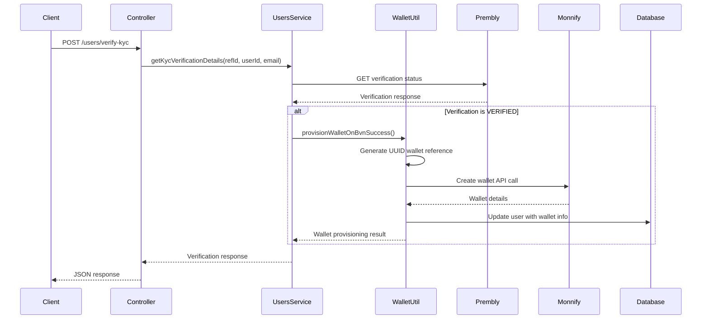

# Wallet Provisioning Implementation

## Overview

This document describes the implementation of automatic wallet provisioning through Monnify when BVN verification is successful using Prembly's KYC verification service.

## Implementation Details

### 1. WalletProvisioningUtil

**Location**: `src/utils/wallet-provisioning.util.ts`

A utility service that handles the automatic provisioning of Monnify wallets when BVN verification is successful.

#### Key Features:
- **UUID-based Wallet Reference**: Generates unique wallet references using UUID v4
- **Environment-aware Wallet Naming**: Wallet names follow pattern: `{env}-{uuid}`
- **Automatic User Data Integration**: Extracts customer information from JWT and BVN verification response
- **Error Handling**: Comprehensive error handling with detailed logging
- **User Record Updates**: Automatically updates user records with wallet information

#### Methods:

##### `provisionWalletOnBvnSuccess(userId, customerEmail, bvnVerificationData)`
- **Purpose**: Main method to provision wallet when BVN verification succeeds
- **Parameters**:
  - `userId`: User ID from JWT token
  - `customerEmail`: Customer email from JWT token
  - `bvnVerificationData`: BVN and customer data from verification response
- **Returns**: `WalletProvisioningResult` with success status and wallet data

##### `extractBvnDataFromPremblyResponse(premblyResponse)`
- **Purpose**: Utility to extract and structure BVN data from Prembly API response
- **Parameters**: Raw Prembly verification response
- **Returns**: Structured `BvnVerificationData`

### 2. Integration with Users Service

**Location**: `src/users/users.service.ts`

The `getKycVerificationDetails` method has been enhanced to automatically trigger wallet provisioning when BVN verification is successful.

#### Enhanced Method Signature:
```typescript
async getKycVerificationDetails(
  referenceId: string,
  userId?: number,
  customerEmail?: string,
): Promise<KycVerificationResponseDto>
```

#### Key Changes:
- Added optional `userId` and `customerEmail` parameters
- Automatic wallet provisioning trigger when verification status is "VERIFIED"
- Non-blocking error handling (wallet errors don't affect verification response)
- Comprehensive logging for debugging

### 3. Controller Updates

**Location**: `src/users/users.controller.ts`

The `verifyKyc` endpoint has been updated to pass user context to the service:

```typescript
async verifyKyc(@Body() verifyKycDto: VerifyKycDto, @Request() req) {
  return this.usersService.getKycVerificationDetails(
    verifyKycDto.reference_id,
    req.user.userId,      // Added: User ID from JWT
    req.user.email,       // Added: User email from JWT
  );
}
```

### 4. Module Configuration

Both `UsersModule` and `WalletsModule` have been updated to include the `WalletProvisioningUtil`:

- **UsersModule**: Added as provider for injection into UsersService
- **WalletsModule**: Added as provider and export for broader access

## Data Flow



## Environment Variables Required

Ensure these environment variables are configured:

```env
# Monnify Configuration
MONNIFY_BASE_URL=https://sandbox.monnify.com
MONNIFY_API_KEY=your_api_key
MONNIFY_SECRET_KEY=your_secret_key
MONNIFY_CONTRACT_CODE=your_contract_code

# Prembly Configuration
PREMBLY_BASE_URL=https://api.prembly.com
PREMBLY_API_KEY=your_prembly_api_key

# Application
NODE_ENV=development
```

## Wallet Creation Details

### Wallet Reference Generation
- **Format**: UUID v4 (e.g., `550e8400-e29b-41d4-a716-446655440000`)
- **Uniqueness**: Guaranteed unique across all wallets

### Wallet Naming Convention
- **Format**: `{environment}-{wallet_reference}`
- **Examples**:
  - Development: `development-550e8400-e29b-41d4-a716-446655440000`
  - Production: `production-550e8400-e29b-41d4-a716-446655440000`

### Customer Information Sources
1. **Customer Email**: Extracted from JWT token (`req.user.email`)
2. **Customer Name**: 
   - Primary: From BVN verification response (`first_name + last_name`)
   - Fallback: From user record (`firstName + lastName`)
3. **BVN**: From BVN verification response

## Database Updates

When wallet provisioning is successful, the following user fields are updated:

```sql
UPDATE users SET
  walletReference = '{generated_uuid}',
  walletAccountNumber = '{monnify_account_number}',
  walletAccountName = '{monnify_account_name}',
  walletBankName = '{monnify_bank_name}',
  walletBankCode = '{monnify_bank_code}',
  bvn = '{verified_bvn}'
WHERE id = {user_id};
```

## Error Handling

### Graceful Error Handling
- Wallet provisioning errors do not affect BVN verification response
- All errors are logged with appropriate detail levels
- User receives consistent verification response regardless of wallet status

### Common Error Scenarios
1. **User already has wallet**: Skipped with warning log
2. **Missing customer name**: Returns error without attempting wallet creation
3. **Monnify API errors**: Logged and returned as wallet provisioning failure
4. **Database errors**: Logged and returned as wallet provisioning failure

## Logging

Comprehensive logging is implemented at various levels:

- **Info**: Successful wallet provisioning
- **Warn**: User already has wallet, non-critical issues
- **Error**: Failed wallet provisioning, API errors
- **Debug**: Detailed request/response data (with sensitive data masked)

## Security Considerations

1. **BVN Masking**: BVN values are masked in logs (`***MASKED***`)
2. **Error Information**: Sensitive error details are not exposed to clients
3. **Authentication**: All operations require valid JWT authentication
4. **Data Validation**: Input validation at multiple levels

## Testing Considerations

### Test Scenarios
1. **Successful Flow**: BVN verified → Wallet created successfully
2. **Already Has Wallet**: BVN verified → User already has wallet
3. **Verification Failed**: BVN not verified → No wallet creation attempt
4. **API Failures**: Monnify API errors → Graceful error handling
5. **Missing Data**: Incomplete BVN response → Proper error handling

### Mock Data Structure
```javascript
// Sample BVN verification response
const mockBvnResponse = {
  data: {
    bvn: "12345678901",
    first_name: "John",
    last_name: "Doe",
    verification_status: "VERIFIED",
    date_of_birth: "1990-01-01"
  }
};
```

## Usage Example

```javascript
// Automatic wallet provisioning on successful BVN verification
const verificationResult = await usersService.getKycVerificationDetails(
  "verification_reference_id",
  123, // userId from JWT
  "user@example.com" // email from JWT
);

// If BVN is verified, wallet is automatically provisioned
// Check user record for wallet details
const user = await userRepository.findOne({ where: { id: 123 }});
console.log(user.walletReference); // UUID
console.log(user.walletAccountNumber); // Monnify account number
```

## Dependencies

- **uuid**: For generating unique wallet references
- **@nestjs/axios**: For HTTP requests to external APIs
- **typeorm**: For database operations
- **@nestjs/config**: For environment configuration

## Future Enhancements

1. **Webhook Integration**: Listen for Monnify wallet status updates
2. **Retry Mechanism**: Implement retry logic for failed wallet creations
3. **Batch Processing**: Handle multiple wallet creations efficiently
4. **Audit Trail**: Track wallet provisioning history
5. **Notification System**: Notify users when wallets are created
